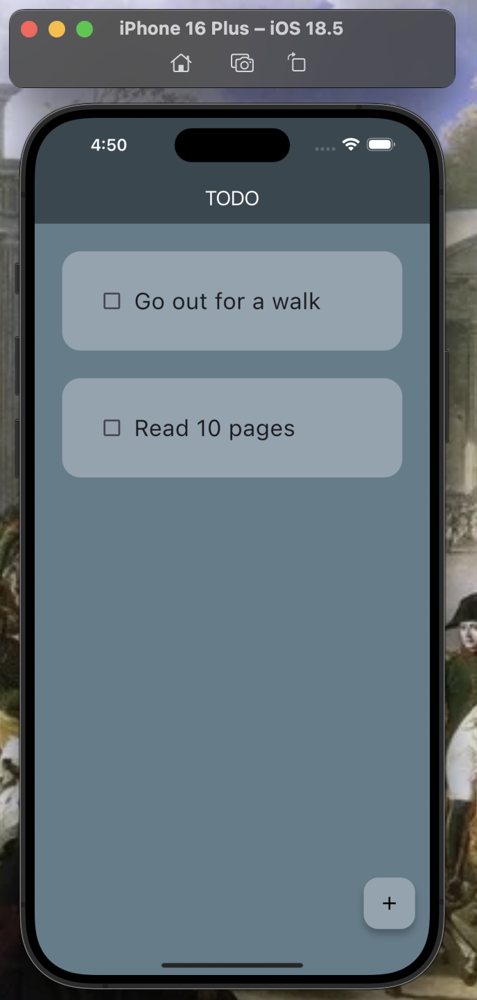

# Simple ToDo App

This- as the title suggests is a simple todo app I made using **Flutter**. This was my first ever Flutter project. I used a [tutorial](https://www.youtube.com/watch?v=TclK5gNM_PM) to code the app however throughout the project I added my own personal customizations.

The app includes all the basic todo app requirements such as creating/deleting a task and saving the tasks on the local device. I do plan to extend these features to potentially having a description for each task and maybe a drawer as well.